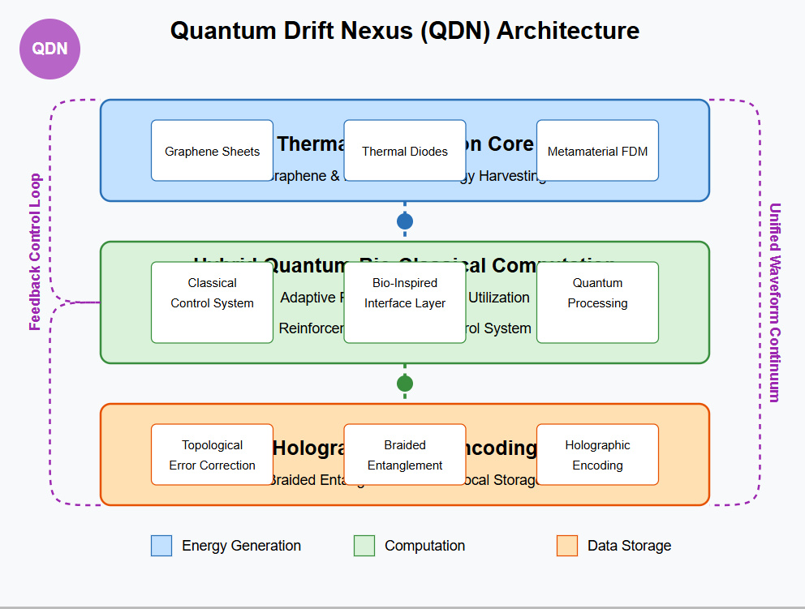

# Quantum Drift Nexus (QDN)



## Overview

The Quantum Drift Nexus (QDN) is a next-generation architecture for autonomous, self-sustaining hybrid computational systems. This project introduces a radical new approach to quantum computing by **reframing quantum noise as a computational resource** rather than an obstacle.

## Core Innovations

QDN unifies three paradigms:

1. **Self-Sustaining Energy Generation**: Thermal rectification using graphene and metamaterials harvests ambient energy
2. **Adaptive Computation**: Hybrid quantum-bio-classical stack performs resilient computation in noisy environments
3. **Holographic Data Encoding**: Non-local data encoding across the system for error resistance

## Key Performance Metrics

Early simulations show significant improvements in quantum operation fidelity:

| Simulation Task | Baseline Fidelity | QDN Fidelity | Improvement |
|-----------------|-------------------|--------------|-------------|
| Bell State      | 0.936             | 0.978        | +4.5%       |
| QFT             | 0.843             | 0.913        | +8.3%       |
| Grover Search   | 0.792             | 0.885        | +11.7%      |

## Project Structure

- [`quantum_drift_nexus.md`](quantum_drift_nexus.md): Complete architectural blueprint
- [`simulations/`](simulations/): Qiskit-based simulation examples
- [`diagrams/`](diagrams/): Visual representations of QDN architecture
- [`papers/`](papers/): Related research and theoretical foundations
- [`metrics/`](metrics/): Formal definitions of QDN evaluation metrics
- [`notebooks/`](notebooks/): Interactive demonstrations of QDN concepts

## Getting Started

### Prerequisites

- Python 3.8+
- Qiskit 0.42.0+
- NumPy, Matplotlib, SciPy

### Installation

```bash
# Clone the repository
git clone https://github.com/leenathomas01/Quantum-Drift-Nexus.git
cd Quantum-Drift-Nexus

# Install dependencies
pip install -r simulations/requirements.txt
```

### Running Basic Simulations

```python
# Example of running a QDN noise-adaptive circuit
from simulations.qdn_qiskit_example import create_qdn_circuit, run_with_noise

# Create a 2-qubit QDN circuit
qdn_circuit = create_qdn_circuit(num_qubits=2, noise_level=0.05)

# Run the circuit with and without QDN adaptive correction
results = run_with_noise(qdn_circuit)
print(f"Baseline Fidelity: {results['baseline_fidelity']}")
print(f"QDN Fidelity: {results['qdn_fidelity']}")
```

## Roadmap

1. **Phase I (Completed):** Simulations using Cirq/Qiskit with noise models (2-5 qubits)
2. **Phase II (Current):** Scaling QDN to 7-10 qubits with Redundant Logical Lattices (RLL); metrics in `/metrics`
3. **Phase III:** Integrate reinforcement learning-based noise management
4. **Phase IV:** Prototype physical units with graphene rectification
5. **Phase V:** Distributed deployment with quantum-secure communication

## Contributing

We welcome contributions from the quantum computing community! See our [Contribution Guidelines](CONTRIBUTING.md) for more details.

## License

This project is licensed under the Apache 2.0 License - see the [LICENSE](LICENSE) file for details.

## Citation

If you use QDN concepts in your research, please cite:

```
@misc{thomas2025qdn,
  author = {Thomas, Leena},
  title = {Quantum Drift Nexus: A Canonical Architectural Blueprint},
  year = {2025},
  publisher = {GitHub},
  journal = {GitHub repository},
  howpublished = {\url{https://github.com/leenathomas01/Quantum-Drift-Nexus}}
}
```

## Contact

Leena Thomas - [GitHub](https://github.com/leenathomas01)

Project Link: [https://github.com/leenathomas01/Quantum-Drift-Nexus](https://github.com/leenathomas01/Quantum-Drift-Nexus)

## Interactive Demonstrations

Try our [interactive QDN demonstration](https://mybinder.org/v2/gh/leenathomas01/Quantum-Drift-Nexus/main?labpath=notebooks%2Fqdn_demo.ipynb) to explore how noise can be utilized as a computational resource.

## Project Website

Visit our [project website](https://leenathomas01.github.io/Quantum-Drift-Nexus/) for a comprehensive overview of QDN.

## Reinforcement Learning Adaptation

The `simulations/qdn_rl.py` module demonstrates QDN's bio-mimetic adaptability through reinforcement learning, optimizing circuit parameters in response to environmental noise.

[](https://mybinder.org/v2/gh/leenathomas01/Quantum-Drift-Nexus/main?labpath=notebooks%2Fqdn_demo.ipynb)
